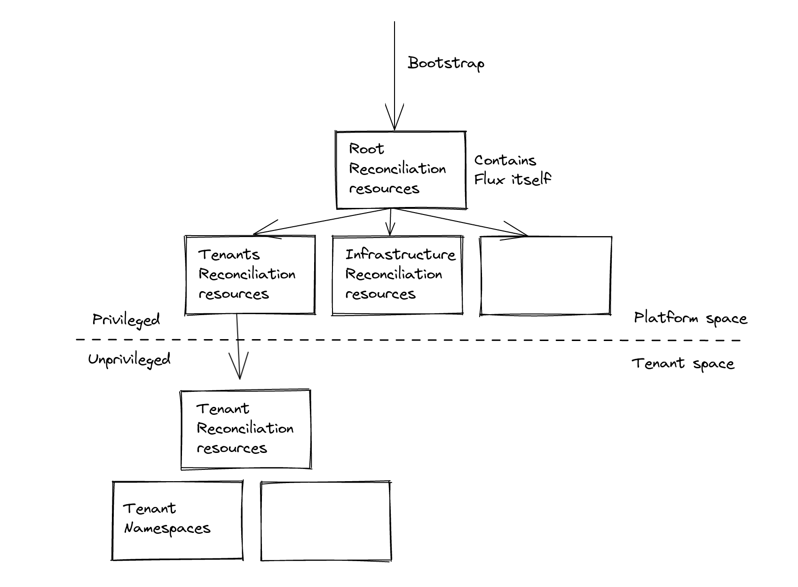
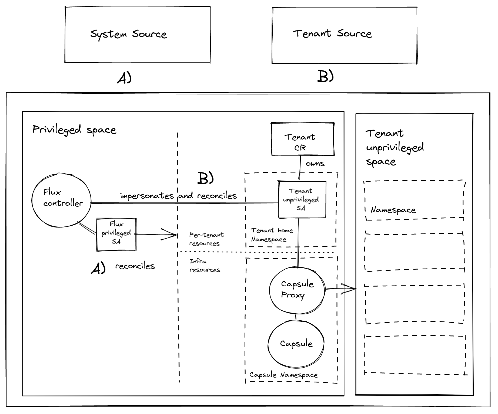

# GitOps multi-tenancy with [Flux v2](https://github.com/fluxcd/flux) and [Capsule](https://github.com/clastix/capsule)

**Provide Namespace-as-a-Service to tenants, the GitOps way.**

Introduce the Tenant concept to GitOps multi-tenancy scenario with Flux v2.

> This repository is a fork of [fluxcd/flux2-multi-tenancy](https://github.com/fluxcd/flux2-multi-tenancy).

## Space declaration

The setup enables unprivileged tenant space, that tenants are able to declare and let Flux reconcile in a secure way.



## Space reconciliation

The secure way of reconciliation is enabled by use of Kubernetes unprivileged-User impersonation and Capsule, that provides boundaries between tenants.



For more details please see the [architecture](./docs/ARCHITECTURE.md)

## Quickstart

### 1. Fork this repository

#### 1.1. Update platform Sync configurations to point to the fork

`GitRepository.spec.url` in `clusters/staging/flux-system/gotk-sync.yaml`

#### 1.2. Update tenants Sync configurations to point to the fork

`GitRepository.spec.url` in `tenants/base/dev-team/sync.yaml`

### 2. Create a personal access token

This is needed to bootstrap Flux configuration to the forked repository and add a deploy key to read from it.

The access token is then discarded and can be revoked.

### 3. Provision a cluster

```
kind create cluster
```

### 4. Bootstrap Flux

```
export GITHUB_USER=<your-username>
export GITHUB_REPO=<repository-name>

flux bootstrap github \
    --owner=${GITHUB_USER} \
    --repository=${GITHUB_REPO} \
    --branch=main \
    --personal \
    --path=clusters/staging
```

### 5. Overwite Flux configuration with multitenancy lockdown (from local repo)

```
git push origin main -f
```

### 6. Create the Secret with kubeconfig for Tenant GitOps reconciler

You need to create a `Secret` containing the `kubeconfig` that specifies:
- `server`: Capsule Proxy `Service` URL
- `token`: the token of the `Tenant` GitOps reconciler

To easy the task let's use `proxy-kubeconfig-generator` utility:

```
go install github.com/maxgio92/proxy-kubeconfig-generator@latest
proxy-kubeconfig-generator \
  --kubeconfig-secret-key kubeconfig \
  --namespace dev-team \
  --server 'https://capsule-proxy.flux-system.svc:9001' \
  --server-tls-secret-namespace flux-system \
  --server-tls-secret-name capsule-proxy \
  --serviceaccount gitops-reconciler
```
